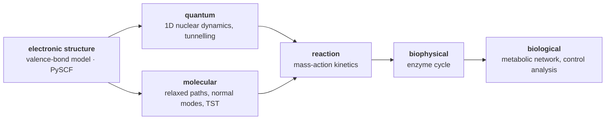

<div align="center">

# substrate

**Propagate scientific models across scales, through one representation, with every hop documented and validated.**


<picture>
  <source media="(prefers-color-scheme: dark)" srcset="docs/images/hero-dark.png">
  
</picture>

</div>

`substrate` follows one physical process through the scales at which it is modelled, from an electronic Hamiltonian, through nuclear quantum
dynamics and reaction kinetics, to an enzyme and the flux of a metabolic pathway. Nothing crosses a scale boundary except through a
**Translator**: a written list of approximations plus a `validate()` that checks them against the actual numbers. If the physics does not support
the hop, the pipeline stops with a reason instead of inventing a result.

On top of that sits a quantitative study built on **real quantum chemistry** (PySCF, from Hartree–Fock to CCSD(T)): can the parameters of a cheap
valence-bond model, fitted to one molecule at one level of theory, say anything about another? They mostly cannot, and the repository measures why.

> **Status: a research prototype.** The software is carefully tested and its statements about itself are measured. The chemistry is a *testbed*
> built on rigid, gas-phase scans, not a prediction of any real system's kinetics. [Read the limits](docs/limits.md) before you quote a number.

## Highlights

- **One representation.** A `ScientificSystem` carries numbers with units (checked, not converted), uncertainty, and a provenance hash chain; every product
  records its inputs, its backend, the approximations of the component that made it, and its warnings.
- **It refuses instead of guessing.** Two chains of equal length are different physics, so the planner raises `AmbiguousPathError` and makes you name
  the route; a barrier below the zero-point energy stops the strip at that stage, with the reason, and keeps everything that completed.
- **Real quantum chemistry, cached.** Single points from PySCF (HF, DFT, MP2, CCSD, CCSD(T)) on any molecule with a donor–proton–acceptor axis, stored on disk
  by content so every later run, and every draw of an uncertainty ensemble, is instant.
- **Calibration with honest diagnostics.** Fit the valence-bond model to a real surface and see which parameters sit on a bound, how well each is determined,
  and how the fit predicts a distance it never saw. The fit's uncertainty is reported as *not* the model's error.
- **A transfer study.** 21 real surfaces (7 molecules, 3 methods; three more built) with cross-prediction, downstream rates and isotope effects through the real chain,
  few-shot learning curves, a coupled-cluster benchmark, and a test of whether the finding survives pinning the bonds to the free diatomics.
- **Mission control.** A local web GUI over the same engines: edit any input and the whole chain re-runs, or explore the transfer study as a clickable matrix.
- **Tested hard.** 429 tests, closed-form and independent checks, and mutation testing of the numerical code. Bugs found in my own work are listed, not hidden.

## Screenshots

All of these are the real GUI (`python -m substrate gui`) running on the cached energies in this repository.

**A real surface through to a rate.** The Hartree–Fock/6-31G* energy surface of the Zundel cation H₅O₂⁺ (a proton shared between two water-like units), computed
by PySCF, and the double well along the proton coordinate that feeds the nuclear quantum dynamics. The panel below lists what the stage assumed.


**Do fitted parameters transfer?** Every calibration applied, unchanged, to every other surface: row = whose parameters, column = whose real energies; the diagonal
is each surface fitted to itself. Anything much worse than the diagonal is a failure to transfer, and the "constant guess" row is what predicting one number would score.


Click a cell to see why. Here the bifluoride's parameters are asked to predict the chloride–hydrogen fluoride ion: the real energies (dots), the bifluoride's
prediction (blue) and the ion's own fit (dashed), the barrier at every distance, and the scores.


<details>
<summary>More views: own fits, fitted parameters, few-shot learning</summary>

**Own fits.** How well each calibration reproduces its own surface, the diagnostics that say where it does not, and which bond model was fitted.


**Parameters.** The fitted values with their uncertainty. The bond length and width look alike across molecules; the coupling and the heavy-atom well, which decide the barrier, do not.
`= donor` marks a surface fitted with one Morse curve for both bonds.


**Few-shot learning.** Fit a target from only k of its heavy-atom distances, with and without another surface's parameters as a Gaussian prior, and score the held-out distances.


</details>

## Quickstart

```bash
git clone https://github.com/hastikacheddy/substrate.git
cd substrate
pip install -e ".[dev]"

python -m substrate run experiments/proton_transfer_pathway.yaml     # five scales, nine stages
python -m substrate gui                                              # mission control, http://127.0.0.1:8765/
pytest -m "not qc"                                                   # 365 tests, no PySCF needed (1.5–5 min)
```

An experiment is a YAML file. Naming only the destination scale is enough when the route is unambiguous, and a `sigma` turns an input into a Monte-Carlo draw through the whole chain:

```yaml
experiment:
  phenomenon: pathway_flux_from_proton_transfer
  system:
    scale: electronic_structure
    kind: electronic.evb_two_state
    parameters:
      coupling: {value: 0.6, unit: eV}
      context.k_release:    {value: 1.0e4, unit: 1/s}                  # carried across every scale untouched
      context.enzyme_total: {value: 1.0e-6, unit: M, sigma: 2.0e-7}    # sigma => an ensemble
  propagation: [biological]
```

### Real quantum chemistry

Real energies need [PySCF](https://pyscf.org), which has no Windows build. On Linux or macOS `pip install pyscf` is enough. On Windows, `scripts/setup_qc_env.sh` creates an
isolated environment inside WSL (no `sudo`, nothing system-wide, everything in `~/.substrate-qc`; remove it with `rm -rf ~/.substrate-qc`):

```bash
wsl bash /mnt/c/<path to this project>/scripts/setup_qc_env.sh
```

The engine finds PySCF itself (in-process if importable, otherwise through WSL); `SUBSTRATE_QC_MODE`, `SUBSTRATE_QC_WSL_DISTRO` and `SUBSTRATE_QC_WSL_PYTHON` override discovery.
Energies are cached by content in `~/.cache/substrate` (or `SUBSTRATE_CACHE_DIR`): the first run of a scan costs minutes, every later run is instant. A coupled-cluster point costs about a
minute and a half in a large basis, so those jobs are sent to the worker in small chunks.

### Examples

| Command | What it shows |
|---|---|
| `python examples/zundel_real_chemistry.py` | A real Hartree–Fock surface, through to a rate and an isotope effect |
| `python examples/calibrate_against_real_chemistry.py` | The cheap model fitted to that surface, and how far its rates are from the real chain |
| `python examples/transfer_across_molecules_and_methods.py` | The 21-reference study: every comparison (computes ~4,500 energies the first time) |
| `python examples/anchoring_the_bonds.py` | Hold every bond at its free diatomic's value and refit all 24 surfaces |
| `python examples/benchmark_bifluoride.py` | HF, B3LYP, MP2 and CCSD(T) in two basis sets on one grid (`--figure` draws the plot) |
| `python examples/pathway_isotope_effect.py` | When an isotope effect survives from the molecule to the pathway flux |
| `python examples/enzyme_isotope_effects.py`, `molecular_vs_quantum.py`, `donor_acceptor_sweep.py` | Commitment regimes; the two routes to a rate; the barrier against heavy-atom distance |
| `python -m substrate calibrate experiments/zundel_hf.yaml --out calibrated.yaml` | Fit the model to a real surface and write an experiment that runs in milliseconds |
| `python -m substrate transfer experiments/references/*.yaml` | Cross-prediction of any set of reference surfaces from the command line |

## How it works



- **Engines** solve a system of one scale and *kind*; **translators** map a solved system to an unsolved one of the next scale and say what they assumed. The registry finds chains kind-aware.
- **Two routes from an electronic surface to a rate** make different approximations (a relaxed classical proton against a frozen heavy-atom distance with tunnelling) and are not interchangeable;
  dividing one by the other to get a "tunnelling factor" is wrong by four orders of magnitude at the defaults.
- **Seams for other hardware and codes**: a `SolverBackend` (eigensolvers, ODE integration) where a GPU or quantum backend would plug in, and a `QCProgram` seam for external quantum-chemistry codes.
- **Uncertainty** is propagated by re-running the whole chain per draw; parameters from a calibration are drawn *jointly* from their covariance, because treating them as independent inflates the rate uncertainty 30×.

More: [architecture](docs/architecture.md) · [the implemented science, scale by scale](docs/science.md) · [adding a scale or a model](docs/extending.md).

## What it found

The details, with every number and the predictions that failed, are in [docs/findings.md](docs/findings.md).

- **An isotope effect survives from the molecule to the pathway flux only if three conditions hold.** The chemical step has an intrinsic H/D effect of ~10; the flux effect is 10.0 when chemistry limits within the enzyme,
  the enzyme is saturated, and it controls the pathway, and falls to 1.00, 1.11 or 1.00 when any one of them is broken.
- **A calibrated model can stand in for real chemistry, for one molecule.** Fitted to the Hartree–Fock/6-31G* surface of the Zundel cation it reproduces it to 0.01 eV where the nuclei sample, and its rates stay within 0.72–1.21× of
  the real chain across nine orders of magnitude, at ~35 ms per chain instead of minutes of energies.
- **Fitted parameters do not transfer.** Each surface fits to 0.01–0.06 eV; the same parameters on another method's surface of the same molecule cost 0.16–0.25 eV, and on another molecule a median of 0.34–0.39 eV, ten times the own-fit
  error and worse than predicting one constant for 89 of 420 pairs.
- **That is not an artifact of letting the bonds float.** The bond lengths and widths *are* physical (within a few percent of the free diatomics). Pinning them there makes the fits much worse (median 0.031 → 0.119 eV) and
  transfer no better: the coupling, the heavy-atom well and the offset, which decide the barrier, are what depends on the molecule and the method.
- **A pair whose two bonds differ needs a curve of its own for each.** The chloride–hydrogen fluoride ion cannot be fitted with one Morse curve (0.41 eV); with `bonds: separate` it fits to 0.03–0.04 eV at HF, B3LYP and MP2,
  with equilibrium lengths near those of free HCl and HF.
- **The methods themselves disagree, in a known direction.** A CCSD(T) benchmark of the bifluoride ion puts HF's barrier too high and B3LYP's too low, and the study's own surfaces miss the CCSD(T)/aug-cc-pVTZ barrier at 2.74 Å by
  +0.19 (HF), −0.19 (B3LYP) and −0.14 eV (MP2), about a thousandfold in a rate at 300 K.

<picture>
  <source media="(prefers-color-scheme: dark)" srcset="docs/images/benchmark-barrier-dark.png">
  
</picture>

## Scientific status

Read [docs/limits.md](docs/limits.md); in brief:

- The cheap model's parameters are **effective, not physical**: fitted couplings are 3–20 eV, and the fitted energy offset is 2–3× the real well gap at Hartree–Fock and larger still at B3LYP and MP2. A good fit shows flexibility, not that the model is right.
- The scans are **rigid, collinear and gas-phase**, with small basis sets. Against CCSD(T)/aug-cc-pVTZ for one ion, the study's barriers are off by 0.14–0.19 eV at 2.74 Å, which is far too much for absolute rates.
- The study has **seven molecules, not twenty-one independent samples** (the methods of one molecule are correlated), and its ordering by "chemical distance" rests on two parent–derivative pairs.
- That EVB parameters are system-specific is already known in the literature; the contribution here is measuring it carefully, with the failed predictions kept in.
- The scales above chemistry (enzyme, pathway) run on free inputs and show *how* lower-scale chemistry is expressed or hidden, not what a real system does.

## Validation

429 tests: 365 run without PySCF (1.5–5 minutes), and 64 need a real quantum-chemistry program. They use closed-form results and independent calculations instead of the code agreeing with itself:

- The two-state model equals the engine's diagonalisation to 1e-10; the closed-form calibration recovers a noise-free surface exactly and reports honest uncertainty on a noisy one.
- The PySCF bridge is checked against physics: the variational principle and the Hartree–Fock limit, invariance under rigid motion, CCSD being exact for two electrons (so the triples correction vanishes),
  and the free-diatomic zero-point energy against a numerically solved Schrödinger equation.
- The tests can fail: well over a hundred one-line mutants of the calibration, transfer, separate-bond, diatomics, engine and command-line code were run; every survivor was either a real test gap, now closed, or
  documented as an equivalent mutant.
- Bugs found in this project's own code are listed in [docs/validation.md](docs/validation.md), including a thread-safety bug in the ODE solver that two browser tabs exposed.

## Repository layout

```
src/substrate/
  ir.py  base.py  pipeline.py  workflow.py      the Scientific IR, engine/translator contracts, routing, provenance and ensembles
  engines/                                      electronic (model, and real quantum chemistry), molecular, quantum, reaction, biophysical, biological
  translators/                                  the documented, validated hops between scales
  qc/                                           PySCF bridge: jobs, SQLite energy cache, a standalone worker that runs inside WSL
  calibration.py  transfer.py  diatomics.py     fit the model to a surface; cross-prediction and learning curves; free X–H Morse curves
  molecules.py                                  templates: Zundel, ammonium dimer, bifluoride, water–ammonia, methanol–water, ...
  gui/                                          the local web GUI: standard-library server, plain HTML/JS, no build step, no external requests
experiments/                                    runnable experiment files; references/ (24 real surfaces) and benchmarks/ (8 bifluoride surfaces)
examples/                                       the scripts in the table above
tests/                                          429 tests
docs/                                           architecture, science, findings, validation, limits, extending, images
```

## Documentation

| | |
|---|---|
| [docs/findings.md](docs/findings.md) | What the studies measured, with numbers and the failed predictions |
| [docs/limits.md](docs/limits.md) | What the numbers can and cannot support |
| [docs/science.md](docs/science.md) | The implemented science, scale by scale |
| [docs/architecture.md](docs/architecture.md) | The IR, routing, backends, the QC bridge, the GUI |
| [docs/validation.md](docs/validation.md) | How each part is tested, and the bugs the tests found |
| [docs/extending.md](docs/extending.md) | Adding the next scale or model |

## Development

```bash
pip install -e ".[dev]"            # add ".[plots]" for the benchmark figure
pytest                             # everything; tests marked `qc` need PySCF and skip without it
pytest -m "not qc"                 # the 365 that do not
```

## Credits and license

Quantum chemistry is computed with [PySCF](https://pyscf.org); diatomic spectroscopic constants are from the [NIST Chemistry WebBook](https://webbook.nist.gov/chemistry/).
Numerics use NumPy and SciPy.

No license has been chosen yet, so the default copyright applies (all rights reserved). Open an issue if you would like to use or contribute to the project.
